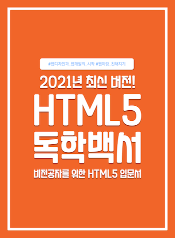

도서 HTML5 독학백서 실습 코드입니다. 책의 목차와 일치 시키기 위해서 부득이하게 `.html` 파일명이 모두 한글로 작성되어 있습니다. (파일을 통째로 다운로드 하게되면 일부 환경에서 파일명이 깨질 수 있습니다.)

- 질문은 [Issue](https://github.com/dalmoori/basic-html5-2021/issues)로 작성해주세요.

## eBook (전자책) 구매 링크

-   [교보문고](http://digital.kyobobook.co.kr/digital/ebook/ebookDetail.ink?selectedLargeCategory=001&barcode=480D210130780&orderClick=LAG&Kc=)
-   [알라딘](https://www.aladin.co.kr/shop/wproduct.aspx?ItemId=262566322)
-   [예스24](http://www.yes24.com/Product/Goods/97163441?OzSrank=1)
-   [Google Books](https://play.google.com/store/books/details/%ED%95%B4%EB%8B%AC%EB%B3%84_HTML5_%EB%8F%85%ED%95%99%EB%B0%B1%EC%84%9C?id=gxcXEAAAQBAJ&hl=ko&gl=kr)
-   [밀리의 서재](https://www.millie.co.kr/v3/bookDetail/179491664?nav_hidden=y)
